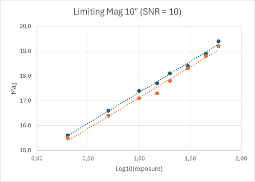

# Some results regarding NEO exposure times

Location: M49, Hakos, Namibia - Bortle 1 skies

Tycho "limiting magnitude" is from Image Evaluation Report, it seems that SNR 10 is the threshold.

## Telescope: 12" f/4 Newtonian

Camera: QHY 268 M, binning 2x2, L filter  
High Gain Mode (1), gain 56, offset 10, cooling -5 °C  
System gain 0.33, read-out noise 3.10 e-, dark current 1.65 e-/pixel/second

Configured base exposure: 240 s for mag 18.0 object

(Removed old measurements)

## Telescope: 10" f/4.5 Newtonian

Camera: QHY 268 M, binning 2x2, L filter  
High Gain Mode (1), gain 56, offset 30, cooling -10 °C  
System gain 0.33, read-out noise 3.10 e-, dark current 1.65 e-/pixel/second

| Single exp | Moon dist | Moon alt | Limiting mag | Remarks |
| ---------: | --------: | -------: | -----------: | ------- |
| 5          | 152       | -73      | 16.5         |
| 5          | 132       | -57      | 16.4         |
| 10         | 162       | -61      | 17.1         |
| 10         | 138       | -84      | 17.3         |
| 10         | 163       | -47      | 17.4         |
| 10         | 169       | -53      | 17.2         |
| 10         | 141       | -13      | 17.2         |
| 10         | 113       | -26      | 17.1         |
| 15         | 158       | -60      | 17.7         |
| 15         | 167       | -47      | 17.7         |
| 15         | 123       | -26      | 17.3         |
| 20         | 141       | -85      | 17.9         |
| 20         | 147       | -86      | 17.8         |
| 20         | 148       | -13      | 17.8         |
| 20         | 149       | -20      | 18.0         |
| 20         | 152       | -52      | 18.1         |
| 20         | 146       | -59      | 18.1         |
| 30         | 143       | -85      | 18.4         |
| 45         | 150       | -79      | 18.8         |
| 60         | 149       | -66      | 19.2         |
| 60         | 140       | -33      | 19.3         |
| 60         | 141       | -68      | 19.2         |

## Limiting Magnitude Overview

From Tycho Tracker's "Image Evaluation Report", SNR = 10, LogSNR = 1

| Moon alt      | Exposure time | Limiting mag 10" | Limiting mag 12" |
| ------------- | ------------- | ---------------- | ---------------- |
| Below horizon | 2             | 15.5 - 15.6      | 16.1             |
| "             | 5             | 16.4 - 16.6      | 17.0 - 17.3      |
| "             | 10            | 17.1 - 17.4      | 18.0             |
| "             | 15            | 17.3 - 17.7      | 18.5             |
| "             | 20            | 17.8 - 18.1      |                  |
| "             | 30            | 18.3 - 18.4      |                  |
| "             | 45            | 18.8 - 18.9      |                  |
| "             | 60            | 19.2 - 19.4      | 19.8 - 20.0      |
|               | Regression    | 2.5 * LOG10(exposure) |             |
|               | Base 1 s      | 14.6 - 14.8      | approx. + 0.6    |

